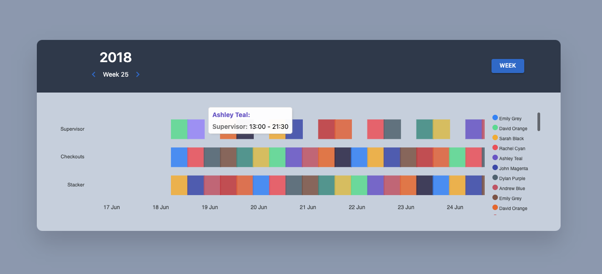

<div style="text-align: center; font-size: 30px">
<br><br>

<h2 style="font-weight:700;"> Simple Shift App </h2>
<br><br>
</div>


----------------------------------------------------------------
## **Libraries**
----------------------------------------------------------------


----------------------------------------------------------------
## **Installation**
----------------------------------------------------------------

```sh
npm install
```

then,

```sh
npm run dev
```

----------------------------------------------------------------
## **ScreenShots**
----------------------------------------------------------------



